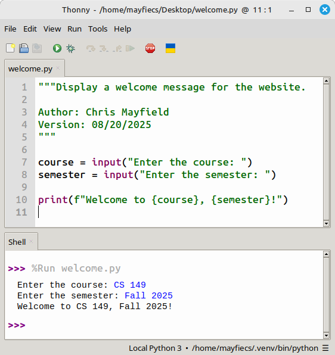

# Introduction to Programming

## Introduction [5 min]

Computers are powerful machines used to perform tasks faster or easier than humans can. Think about sending a text message or using a calculator. When you send a text, you're basically just talking to someone without being limited by where you are or when you say something. When you use a calculator, you can do math operations that might take minutes to perform in only a few seconds.

To create these things on a computer, we **program** the computer, which basically means that we tell it what to do. Think about how you might read a recipe for baking cookies and then tell your friend each instruction in order. Thinking from a programming perspective, you would be the **programmer** (the person telling the computer what to do), the instructions are called the program's **code**, and your friend is the computer, executing your instructions.

Just as you might tell your friend the instructions to bake cookies in English, programmers have their own languages for talking to computers. Don't worry, though, they still mostly use words from English in them. The one that we will be using today is called Python. Over the course of this workshop, we will program the computer through Python and learn the basics of how we can use our computers to solve problems and build cool projects.

## Thonny [5 min]

On your computer, we have opened an app called Thonny. This app is specifically designed to allow you to write code in Python and run it on your computer. If your screen does not look like the picture here, please let one of us know and we will help you!



## Showing text [10 min]

One of the main goals of programming is to have the computer produce output. Think back to us baking: what's the point of us following all those instructions if we don't get to eat the cookies at the end? The cookies were the output of our recipe! Similarly, we can use Python code to have our computer generate output. Type (or copy) the following Python code into Thonny:

```py
print("Hello, world!")
```

Once you've added it, click the green play button in the top left bar and pay attention to what happens at the bottom in the Shell window. Everything in between the purple arrows is the output of the program. Notice that everything in between the quotes (`"`) in your code was shown in the output.

What we showed you in the code above is named a **print call**. Unlike how you would normally think of printing, there is no paper involved here. Instead, the printing we're talking about here means what is being displayed in the output. You can write multiple print calls in your code to show many things in the output:

```py
print("I am 20 years old!")
print("Wow, I'm old...")
```

The "call" part of the name comes from the way the code looks. Any code that looks similar to `f(x)` is named a **call**. In our first print call, `f` is `print` and `x` is `"Hello, world!"`! Calls allow you to tell the computer you want to do some action: a print call tells the computer you want to show whatever you give it in the output.

### Exercise 1. All About You!

Write two print calls in your Python program. The first one should introduce yourself, and the second one should be the age of the JMU Computer Science department's pet cat. Her name is Kiki and she is 8 years old!

The output should look something like this after you click the green play button:

```
Hi! My name is Ajax
The cat's age is 8
```

## Variables [10 min]

Imagine if my code had these two print calls in it:

```py
print("Hi! My age is 20")
print("Gosh, you're old if you're 20")
```

Now imagine it was next year and I turn 21. I'd have to change both my print calls to update my code! If my code keeps getting bigger and bigger, I might have 10, 20, or even more places where I would have to change my age! Luckily, Python has a solution to repetition like this: variables!

```py
my_age = 20
print("Hi! My age is", my_age)
print("Gosh, you're old if you're", my_age)
```

Instead of putting my age in two places, I say what my age is beforehand and give it a name that I can refer to it by `my_age`. We can say that the **value** of the `my_age` variable is `20`.

!!! note annotate "Note"

    Names of variables in Python cannot include spaces, so programmers often replace them with underscores (`_`). This is why the name of the variable in the example above is `my_age` instead of `my age`.

Notice that the print calls have changed! It turns out that you can actually put multiple things in the parentheses for the print call separated by commas (`,`), making our `f(x)` example from before into something more like `f(x, y)`! Also, we can put variables into our print calls as well, which is pretty neat.

Another interesting thing you might've noticed in the code above is that I didn't put quotes around the `20` when I specified my age for the variable. It turns out that computers do not store text (the stuff you've seen surrounded by quotes like `"Hello, world!"`) in the same way that they store numbers:

```py
my_age_number = 20
my_age_text = "20"
```

These are NOT the same!

Right now, this probably doesn't seem like that big of a deal. However, the Python math operations will not work on the text versions of numbers, instead only working on what Python considers actual numbers.

Python determines what is an actual number by looking at the **data type** of a variable in your code. The data type of the variable is determined by whatever value you gave it (which is anything to the right of the equals `=` sign). In the example above, `my_age_number` has the `int` data type because I assigned it the value `20`. `int` stands for "integer" and it basically means a whole number. `my_age_text` has the `str` data type because I assigned it the value `"20"`. `str` stands for "string", which is a programmer's fancy way of saying "text".

You can use other variables in your code to calculate new variables with your typical math operations:

```py
my_age = 20
my_age_next_year = my_age + 1
```

The value of `my_age_next_year` will be `21`.

!!! warning annotate "Warning"

    Note that this wouldn't have worked if `my_age` was text (or a string):

    ```py
    my_age = "20"
    my_age_next_year = my_age + 1
    ```

Here are the operations we can use on variables:

```py
my_age = 20
my_age_next_year = my_age + 1   # Addition
my_age_last_year = my_age - 1   # Subtraction
my_cat_age = 8 * my_age         # Multiplication
my_divided_age = my_age // 5    # Division
```

### Exercise 2. Human Years Conversion

Take your name and your pet's age from Exercise 1 and put them in variables. Replace them in your print calls with the variables you just created.

Then, use the variable that stores the JMU CS cat's age to calculate the cat's age in human years. You can do this by multiplying the cat's age by 8.

Once you've done that, modify your second print call to show the human age of the cat instead.

The output should look something like this after you click the green play button:

```
Hi! My name is Ajax
The cat's age in human years is 64
```

## Talking to the computer [10 min]

Although it's pretty cool that we can do calculations like finding the human age of a cat, wouldn't it be even cooler if each time we ran the program we could *ask* about our user's cat? If we could do this, we could make it so anyone could use our program to find *their* cat's human age!

Luckily, Python provides us this ability! We can make an **input call** to ask the user about stuff we care about:

```py
input("What's your cat's age? ")
```

!!! note annotate "Note"

    The space after the question mark in the question we're asking will put space between the question and the user's response.

We have a problem, though. After we ask the user for their cat's age, how do we get their response?

It turns out that input calls are a little more special than our print calls from earlier. By making a variable and setting its value to our input call, we can get the response!

```py
cat_age_text = input("What's your cat's age? ")
```

For example, if I were to run this code (by hitting the green arrow button in the top left) and type `8` when it asked me for my cat's age, the `cat_age_text` variable would have the value `"8"`.

There are two interesting things about this:

1. The value in a variable doesn't have to be exactly what comes after the equals sign! It can also be the result of a call, like our input call.
2. The data type of the `cat_age_text` variable is **not** `int`. Instead, it's a `str` (which is just text). This means I can't do math with `cat_age_text`.

How do we solve the second issue? It turns out that Python provides us the ability to convert text with numbers in it into actual numbers:

```py
cat_age_text = "20"
cat_age = int(cat_age_text)
```

With the **int call**, we can convert `"20"` (which has the data type `str`) into `20` (which has the data type `int`)! So in this example, `cat_age` has the value `20`.

Combining these two code examples, we can simply write:

```py
cat_age_text = input("What's your cat's age? ")
cat_age = int(cat_age_text)
```

First, we ask the user what their cat's age is. This age is then stored as the value of the variable `cat_age_text`. But we have a problem: the data type of the variable `cat_age_text` is `str`! We can't do math on it yet, so we use an int call to convert `cat_age_text` into a number, making it have the `int` data type. Then, we set `cat_age` to be that value.

### Exercise 3. Asking Your User

Working off of Exercise 2, rewrite your variables that store your name and the JMU CS cat's age to instead ask the user for their name and cat's age.

Running your program should look something like this after you click the green play button. The example responses for this run of the program are after the question marks in the questions.

```
What is your name? Ajax
What's your cat's age? 8
Hi! Your name is Ajax
Your cat's age in human years is 64
```

## Basic conditional programming [10 min]

At this point, you have developed quite a substantial program. But, what if we wanted to take it a step further? Imagine if we were to also ask the user what *type* of animal their pet was? Then, depending on what type of pet they tell us, we calculate that pet's age in human years.

To solve this problem, the most important thing to identify is how we will determine how to calculate the pet's age in human years. If the user's pet is a dog, we want our program to *only* calculate the human age for a dog, not any other animal. Python's solution to this is the `if` statement:

```py
pet_type = input("What type of animal is your pet? ")
if pet_type == "cat":
    print("Your pet is a cat!")
```

In the above code snippet, Python will check to see if the `pet_type` variable is equal to `"cat"`, and run the print call if it is. Notice how checking for something to be equal to another thing uses `==` instead of `=`. This is because we already are using `=` to set the values of variables, and the people who made Python didn't want to confuse people and use the same symbol twice for two different operations.

### Exercise 4. Multiple Types of Animals

Building off of Exercise 3, ask the user about the type of animal that their pet is in the same way you did for their name. Then, using the type of animal, calculate its age in human years for both cats and dogs. You already have the calculation for cats, and you can incorporate dogs in using `if` statements. A dog's age in human years is 7 times its original age.

After updating your exercise, running your program should look something like this after you click the green play button. The example responses for this run of the program are after the question marks in the questions.

```
What is your name? Ajax
What's your pet's age? 8
What type of animal is your pet? dog
Hi! Your name is Ajax
Your dog's age in human years is 56
```

## Additional Learning Resources

Thanks to [Dr. Chris Mayfield](https://w3.cs.jmu.edu/mayfiecs) from the JMU Computer Science Department for compiling these resources!

 - [W3Schools Tutorial](https://www.w3schools.com/python)
 - [Python for Everybody](https://www.py4e.com/book)
 - [The Coder's Apprentice](https://www.spronck.net/pythonbook)