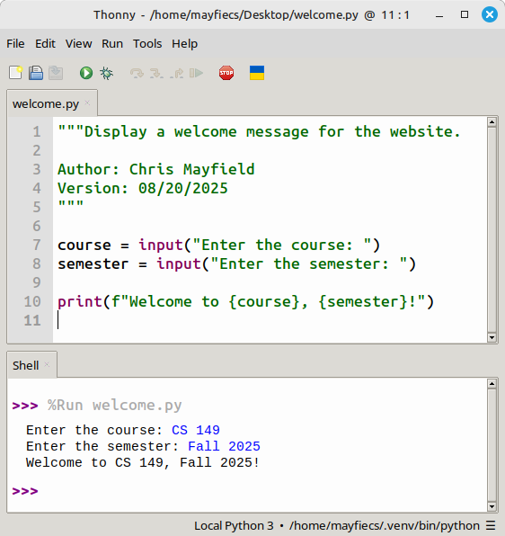

# Introduction to Programming

## Introduction [5 min]

Computers are powerful machines used to perform tasks faster or easier than humans can. Think about sending a text message or using a calculator. When you send a text, you're basically just talking to someone without being limited by where you are or when you say something. When you use a calculator, you can do math operations that might take minutes to perform in only a few seconds.

To create these things on a computer, we **program** the computer, which basically means that we tell it what to do. Think about how you might read a recipe for baking cookies and then tell your friend each instruction in order. Thinking from a programming perspective, you would be the **programmer** (the person telling the computer what to do), the instructions are called the program's **code**, and your friend is the computer, executing your instructions.

Just as you might tell your friend the instructions to bake cookies in English, programmers have their own languages for talking to computers. Don't worry, though, they still mostly use words from English in them. The one that we will be using today is called Python. Over the course of this workshop, we will program the computer through Python and learn the basics of how we can use our computers to solve problems and build cool projects.

## Thonny [5 min]

On your computer, we have opened an app called Thonny. This app is specifically designed to allow you to write code in Python and run it on your computer. If your screen does not look like the picture here, please let one of us know and we will help you!

## Showing text [10 min]

## Variables [10 min]

## Talking to the computer [10 min]

## Conditionals [10 min]
